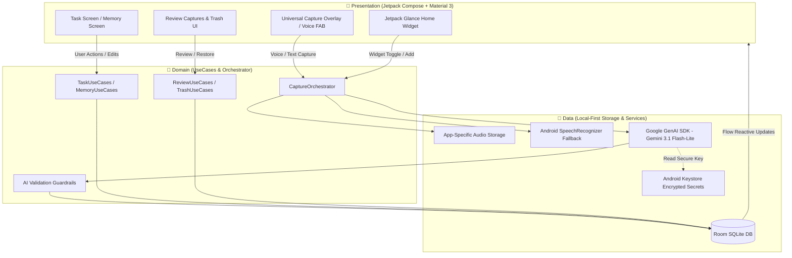

<div align="center">

# 🧠 ADHDmate ☕
### *A cozy place for a chaotic brain*

<p align="center">
  <strong>"I forgot, but the app remembered."</strong><br>
  <em>A cozy, local-first cognitive capture & living memory engine.</em><br>
  <em>Designed for chaotic brains with big things to do.</em>
</p>

[-3DDC84?style=for-the-badge&logo=android&logoColor=white)](https://developer.android.com)
[](https://kotlinlang.org)
[-4285F4?style=for-the-badge&logo=jetpackcompose&logoColor=white)](https://developer.android.com/jetpack/compose)
[](https://developer.android.com/training/data-storage/room)
[](https://ai.google.dev)
[](#-project--repository-notice)
[](https://github.com/dev-vishalgupta/ADHDmateApp/releases/tag/v1.0.0)
[]()

<br/>

[📥 Download APK](#-download--installation) •
[✨ Features](#-key-features) •
[🧠 Philosophy](#-the-adhdmate-philosophy) •
[🔄 Capture Flow](#-capture--action-flow) •
[🏗️ Architecture](#-system-architecture) •
[🎨 Design System](#-neuro-inclusive-cozy-design-system) •
[🛠️ Tech Stack](#️-tech-stack--dependencies) •
[🔒 Privacy](#-privacy--local-first-guarantee) •
[❤️ Author](#-about-the-developer)

</div>

---

> [!IMPORTANT]
> ### 🔒 Project & Repository Notice
> **ADHDmate is proprietary software and is not open source.** The underlying source code is not publicly hosted or available on GitHub.
>
> This repository serves as the **official documentation showcase, technical overview, and distribution hub** for the application:
> - 📖 **Architecture & Design Showcase:** Explaining the technology stack, UX patterns, and local-first architecture behind the app.
> - 📦 **APK Distribution:** Official, signed release builds are distributed directly through this repository under the [**Releases**](https://github.com/dev-vishalgupta/ADHDmateApp/releases/tag/v1.0.0) tab.
> - 🆓 **100% Free Forever:** ADHDmate is completely free to use—no paywalls, no subscriptions, and no advertisements.

---

## 📥 Download & Installation

You can download the latest official release APK directly from GitHub:

[](https://github.com/dev-vishalgupta/ADHDmateApp/releases/tag/v1.0.0)

### 📲 How to Install

1. **Download the APK**: Head to the [**ADHDmate v1.0.0 Release**](https://github.com/dev-vishalgupta/ADHDmateApp/releases/tag/v1.0.0) page and download `ADHDmate-v1.0.0.apk` from the Assets section.
2. **Open the File**: Tap the downloaded file in your browser downloads or file manager.
3. **Allow Unknown Sources**: If Android prompts you with a security alert, select **Settings** &rarr; toggle on **Allow from this source** (standard for direct APK installs outside Google Play).
4. **Install & Launch**: Tap **Install**, then open ADHDmate and begin capturing your thoughts immediately!

> [!TIP]
> **System Requirements:**
> - **Platform:** Android 8.0 (API level 26) or higher.
> - **Permissions:** Microphone access (strictly used for on-device voice capture and local audio recording).
> - **Account:** Zero sign-up required. Works fully offline out of the box.

---

## 🌟 The ADHDmate Experience

A thought can appear out of nowhere and disappear just as quickly.

**ADHDmate** gives you a safe, friction-free place to **catch it before it's gone**.

🎙️ **Record the thought.**  
🧠 **Let ADHDmate handle the rest.**

Your thought is transcribed on-device and can optionally be understood with **Gemini 3.1 Flash-Lite** to be turned into an actionable **Task** or structured **Memory**. The original `.m4a` audio recording always stays with you, so you can listen back or re-transcribe anytime.

Whether you are on the Home screen, glancing at an interactive widget, or just need to get something out of your head:

> **Think it. Capture it before it disappears. Let ADHDmate take it from there.**

---

## 🧠 The ADHDmate Philosophy

<table>
<tr>
<td width="50%" valign="top">

### 💡 Why ADHDmate Exists
> *"There was a time when I hated how easily my own mind could let me down. I could have an exam the next morning and still somehow forget to study. I’d get so caught up in my head that I would forget to eat, miss an important task, or lose a brilliant thought just moments after having it.*
>
> *The worst part wasn’t forgetting. It was knowing that I cared. I tried. But sometimes, my brain simply moved faster than I could keep up with.*
>
> *ADHDmate is a small, safe place to put things down before your mind carries them away."*

</td>
<td width="50%" valign="top">

### 🎯 Core Principles
1. **Don't make your brain organize before saving**: Capture first. Decide later.
2. **Zero cognitive overload**: No complex nested menus or confusing hierarchies.
3. **Local-First & Offline Resilient**: Works 100% offline with on-device speech transcription.
4. **AI assists, never oversteps**: AI interprets your brain dump, but never takes silent control or completes tasks autonomously.
5. **100% Free Forever**: No ads, no paywalls, no subscriptions.

</td>
</tr>
</table>

---

## 🔄 Capture &rarr; Action Flow

Traditional productivity systems expect you to:
$$\text{Remember} \longrightarrow \text{Plan} \longrightarrow \text{Organize} \longrightarrow \text{Execute}$$

ADHDmate flips this on its head for neurodivergent brains:

```
          🧠 THOUGHT
              ↓
         ⚡ CAPTURE  (Voice / Text)
              ↓
     ┌────────┴────────┐
     ↓                 ↓
  📋 TASK           💡 MEMORY
     ↓                 ↓
   ✅ DO           📖 REMEMBER
```

---

## ✨ Key Features

### 🎙️ 1. Ultra-Low Friction Universal Capture
* **Press-and-Hold Voice Recording**: Hold the mic button, speak your mind with real-time waveform feedback, and release.
* **Preserved Raw Audio**: The original `.m4a` file is saved locally in private app storage. Listen back or re-transcribe at any time.
* **On-Device Speech Recognition**: Transcribe voice seamlessly without internet or external servers using Android's native `SpeechRecognizer`.
* **Instant Text Composer**: Clean, full-screen text capture for when you prefer typing.

### 📋 2. Frictionless Task Management
* **Intuitive Gestures**:
  * 🟢 **Swipe Right** &rarr; Complete task
  * 🔴 **Swipe Left** &rarr; Delete to Trash
* **Priority Highlighting & Pinning**: Keep urgent items visually distinct without complex priority matrices.
* **Quick Filter Chips**: Filter between Active and Completed items in one tap.

### 🧠 3. Living Memories System
* **Bulleted Thoughts**: Automatically formats multi-point brain dumps into clean, scannable bullet points.
* **Rich-Text Styling**: Full user-controlled formatting: **Bold**, *Italic*, <u>Underline</u>, <mark>Highlight</mark>, Text Color, Quotes, and Lists.
* **Smart Memory Merging**: Combine related memories together without losing previous context.
* **Category Icons**: 15+ curated visual categories (Ideas, Health, Finance, Study, Work, Travel, Media, Home, etc.).
* **Instant Search**: Find any thought instantly as you type.

### 🤖 4. Ethical, Non-Destructive AI (Gemini 3.1 Flash-Lite)
* **Strict Actions**: AI can only trigger `CREATE_TASK`, `CREATE_MEMORY`, or `UPDATE`.
* **Explicit Destination Wins**: *"Add this to my Vacation memory"* will always route directly to your designated memory.
* **Zero Hallucinations Guarantee**:
  * ❌ Never invents fake dates, deadlines, or categories.
  * ❌ Never completes or deletes tasks autonomously.
  * ❌ Never overwrites unrelated memories.
* **Review Queue**: Ambiguous captures are marked with a yellow `!` badge for easy one-tap review and conversion.

### 🏠 5. Interactive Home Screen Widgets (Jetpack Glance)
* **Glanceable Tasks**: View and complete your tasks directly on your Android home screen.
* **Instant Shortcuts**: Tap the widget's mic or plus icon to capture a thought immediately without opening the app.

### 🗑️ 6. Resilient Recovery (Trash System)
* **Soft Deletion**: Tasks, memories, and voice captures are moved to Trash rather than permanently erased.
* **One-Tap Restore**: Accidental swipes can be undone effortlessly.

### ☁️ 7. Google Drive Backup
* **Optional Cloud Backup**: Connect your Google account to manually or automatically back up your SQLite database to your private Google Drive. 
* **Safe and Secure**: No live two-way syncing. Your device is the single source of truth, and Drive acts purely as a secure fallback.

---

## 🎨 Neuro-Inclusive Cozy Design System

ADHDmate is intentionally styled to avoid the cold, clinical feel of corporate productivity tools. It features warm, grounding tones and calming contrast:

| Token | Light Theme | Dark Theme | Purpose |
| :--- | :---: | :---: | :--- |
| **Background** | `Color(0xFFF7F3EA)` | `Color(0xFF1D1B19)` | Soft, warm paper neutral (prevents eye strain) |
| **Surface** | `Color(0xFFFFFDF8)` | `Color(0xFF272421)` | Elevated, calming card containers |
| **Accent** | `Color(0xFFB86B52)` | `Color(0xFFD4876D)` | Warm terracotta (gentle, motivating focus) |
| **Success** | `Color(0xFF668B68)` | `Color(0xFF86A887)` | Muted sage green for satisfying completion |
| **Review / Warning**| `Color(0xFFE4C56A)` | `Color(0xFFB8953F)` | Gentle amber badge for items needing review |
| **Danger** | `Color(0xFFB85C5C)` | `Color(0xFFD27A7A)` | Soft rust red for trash and destructive confirmations |

---

## 🏗️ System Architecture

ADHDmate is engineered with **Clean Architecture** and **Unidirectional Data Flow (UDF)** to guarantee local-first performance and reliability:



---

## 🔒 Privacy & Local-First Guarantee

* 🔐 **Hardware-Protected API Key**: Your Gemini API key is encrypted using the **Android Keystore** and stored in private `EncryptedSharedPreferences`.
* 📦 **Local Database**: All notes, tasks, recordings, and metadata remain strictly on your physical device in SQLite.
* 🎙️ **Private Audio Files**: Audio files are saved exclusively in app-specific storage (`context.filesDir`).
* 🚫 **Zero Tracking**: No advertising IDs, no third-party trackers, and no telemetry data collection.
* ☁️ **Private Backups**: If you opt in to Google Drive Backup, data goes strictly to your own personal Google account, never to third-party servers.
* 💳 **Direct UPI Support**: Voluntary community donations use installed UPI apps directly without intermediate payment gateways or tracking.

---

## 🛠️ Tech Stack & Dependencies

| Layer | Technology | Version | Purpose |
| :--- | :--- | :--- | :--- |
| **Language** | **Kotlin** | `2.0.21` | Modern, type-safe Android development with coroutines |
| **UI Framework** | **Jetpack Compose** | `BOM 2026.02.01` | Declarative UI, smooth gestures, and reactive state rendering |
| **Design System** | **Material 3 + Tokens** | Latest | Dynamic theming with custom Poppins typography |
| **Local Database** | **Room** | `2.7.1` | Robust offline-first SQLite database with Flow queries |
| **Widget Engine** | **Jetpack Glance** | `1.1.1` | Interactive Compose-style home screen app widgets |
| **AI SDK** | **Google GenAI SDK** | `1.65.0` | Direct integration with Gemini 3.1 Flash-Lite |
| **QR Utility** | **ZXing Core** | `3.5.3` | Offline QR generation for seamless UPI support |
| **Testing** | **Robolectric & JUnit** | `4.14 / 4.13.2` | Comprehensive unit and integration test coverage |

---

## 👨‍💻 About the Developer

<div align="center">

**Developed with ❤️ by Vishal Gupta**  
*Founder of AngelMindAI*

*"Building technology that empowers neurodivergent brains to thrive."*

[](https://angelmindai.com)
[](https://github.com/dev-vishalgupta)

</div>

```text
ADHDmate — 100% Free for chaotic brains with big things to do. 🫠
```
